# Hướng dẫn chi tiết

**Cài đặt VMware Workstation Pro**

**---key bản quyền VMware Workstation Pro 16 ---**

```
ZF3R0-FHED2-M80TY-8QYGC-NPKYF
YF390-0HF8P-M81RQ-2DXQE-M2UT6
ZF71R-DMX85-08DQY-8YMNC-PPHV8
FC11K-00DE0-0800Z-04Z5E-MC8T6
```

# Cấu hình network cho VMware Workstation Pro

Bước này nhằm mục đích setup dải IP mình sẽ dùng cho các máy ảo (VM) sau này. Để thực hiện, các bạn mở VMware Workstation Pro vào mục edit ==> Virtual Network Editor ==> Chọn vào loại network là NAT:

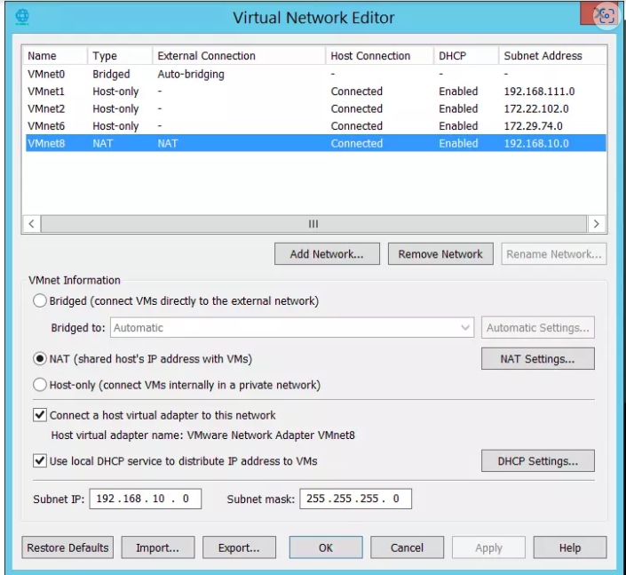

Ở đây mình hướng dẫn sử dụng NAT, khi đó các VM sẽ được cấp một private IP trong dải mà bạn cài đặt ở mục Subnet IP. Các bạn có thể setup dải này tùy ý, ở đây mình recommend dùng dải 192.168.10.0 mask 255.255.255.0 (như hình).

# Hướng dẫn cài đặt Centos7 và cấu hình tham số

```
Máy ảo    Role      IP             RAM   CPU      HDD       Note
master1   master    192.168.10.11  3GB   2 core   50GB+50GB CICD 
master2   master    192.168.10.12  3GB   2 core   50GB+50GB longhorn storage
master3   master    192.168.10.13  3GB   2 core   50GB+50GB longhorn storage
worker1   worker    192.168.10.14  4GB   2 core   50GB+100GB longhorn storage
worker2   worker    192.168.10.15  4GB   2 core   50GB+100GB longhorn storage
worker3   worker    192.168.10.16  4GB   2 core   50GB+100GB longhorn storage
racher              192.168.10.18  3GB   2 core   50GB+100GB+100GB longhorn storage + NFS-Server 
cicd      kubespray 192.168.10.20  3GB   2 core   50GB+100GB longhorn storage
```

**Cài đặt centos7 lên máy ảo (VM)**

Đầu tiên các bạn download bộ cài Centos7 [http://centos-hcm.viettelidc.com.vn/7/isos/x86_64/], nhớ chọn đúng file "CentOS-7-x86_64-Minimal-2009.iso" cho nó nhẹ!

Sau khi download file về máy, thì mở VMware Workstation Pro để chuẩn bị cài đặt một VM mới. Các bạn vào File ==> New Virtual Machine.. ==> Typical ==> Next ==> Installer disc image file (iso): ==> Trỏ tới file iso centos mà đã download về máy ở bước trước ==> Next

Tiếp tục điền tên của VM (tên hiển thị trên VMworkstation Pro) và nơi lưu các bạn muốn lưu máy ảo này ==> Next:

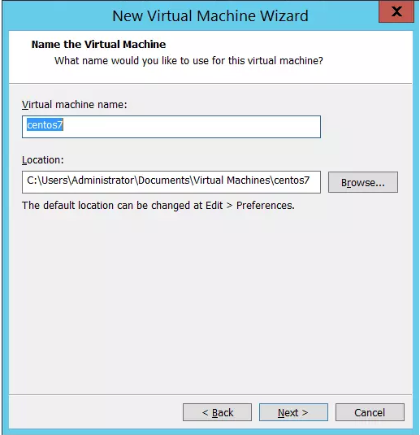

Trong mục "Maximum disk size (GB)" chọn dung lượng 30GB, tick chọn "Split virtual disk into multiple files ==> Next.

Gần xong rồi, giờ tới bước cấu hình tài nguyên cho máy ảo. Tick vào "Poweron this virtual machine after creation" và ấn vào Customize Hardware...:

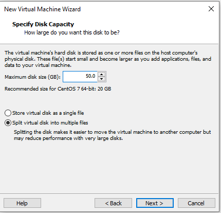

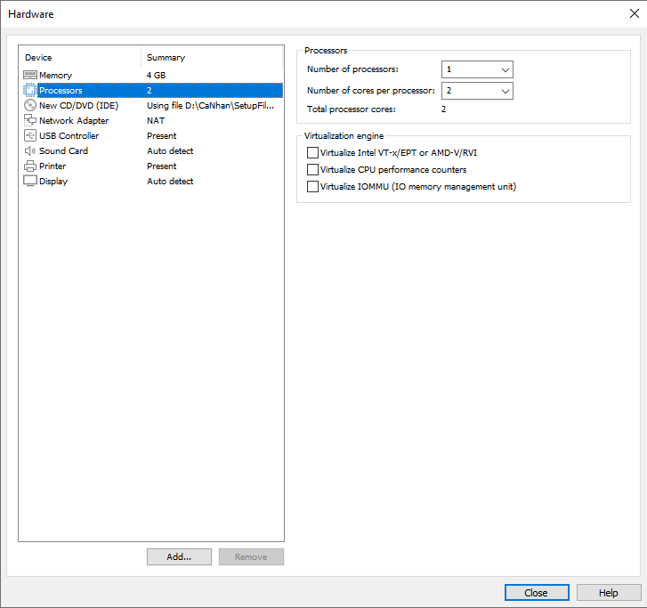

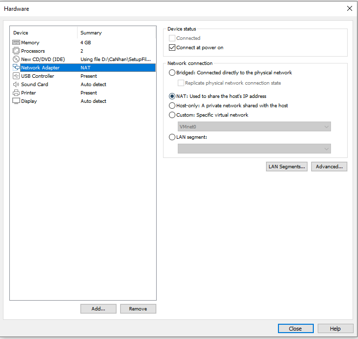

Okie rồi, giờ ấn Finish thôi để bắt đầu cài đặt thôi. Ở giao diện này các bạn ấn Enter để thực hiện cho nhanh không phải chờ mấy chục giây nhé:

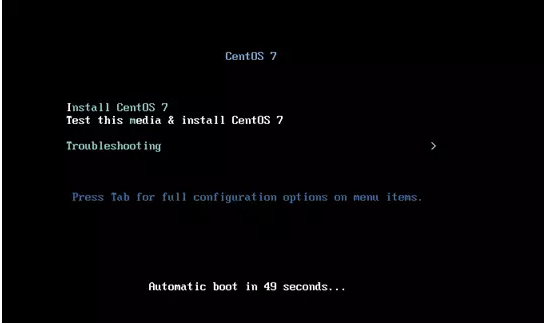

Ở giao diện đầu tiên chọn ngôn ngữ English:

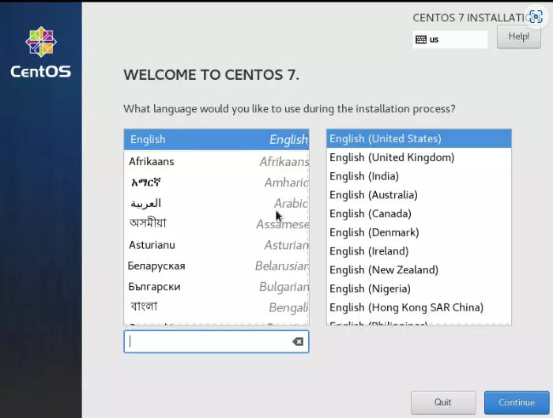

Tiếp theo ở giao diện này ta sẽ cầu hình thời gian (datetime), phân vùng cài đặt (INSTALLATION DESTINATION) và network.

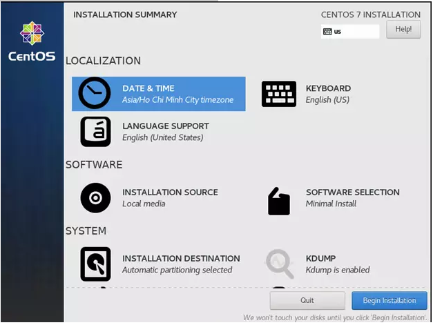

Chọn vào DATE & TIME và cài đặt giờ cho máy chủ + set timezone về HCM ==> Ấn Done khi hoàn thành.

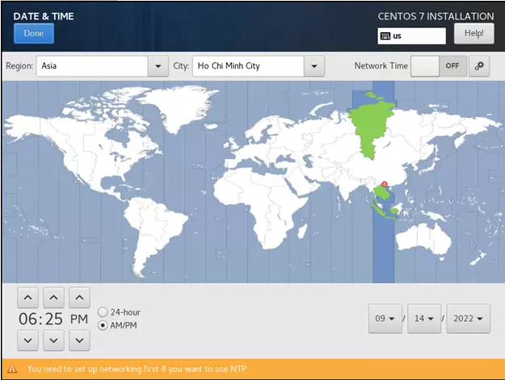

Tiếp tục chọn "INSTALLATION DESTINATION" ==> Chọn vào ổ 30GB mà ta đã tạo ==> Done

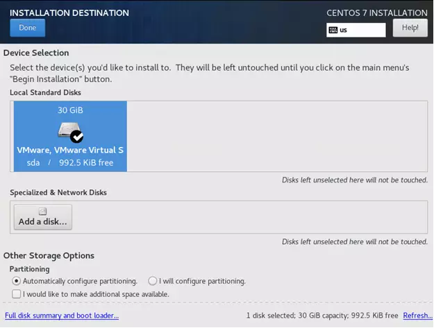

Tiếp theo là cấu hình Hostname và network. Đầu tiên điền hostname là centos7 ==> Apply. Tiếp theo enable cái network Ethernet (ens33) cho nó thành màu xanh như hình:

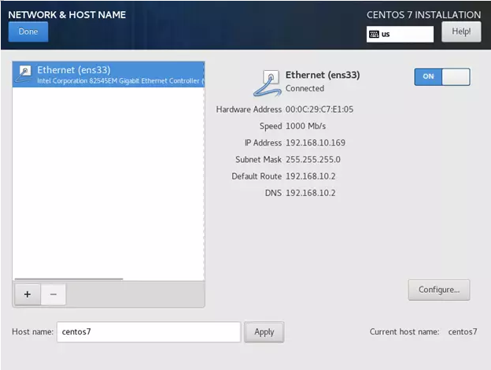

Chọn tiếp vào Configure... để cấu hình IP cho nó:

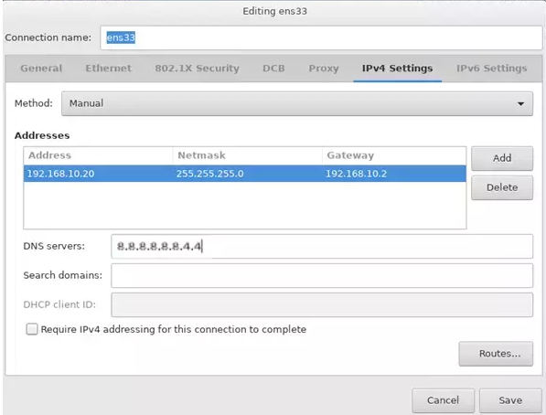

Ta chọn vào thẻ IPv4 Settings và chọn Method từ "DHCP" thành "Manual", ấn nút Add và đặt thông số như sau:

IP	            Netmask	        Gateway
192.168.10.20	255.255.255.0	192.168.10.2

DNS mình đặt là 2 DNS của google để VM có thể kết nối ra internet: 8.8.8.8, 8.8.4.4

**Sở dĩ ở đây mình đặt IP là 192.168.10.20 là để tránh các IP mình đã planning cho các node. Sau này khi clone máy ảo này ra mình sẽ sửa lại IP theo đúng quy hoạch.**

Hoàn thành bước trên thì ta ấn vào **Begin Installation** để bắt đầu quá trình cài đặt Centos 7. Tiếp theo ta cần set password cho user root bằng cách ấn vào ROOT PASSWORD và nhập 2 lần pass vào đó.

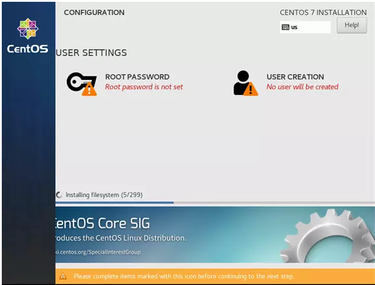

Ấn tiếp vào **USER CREATION** để tạo thêm một super user có tên sysadmin:

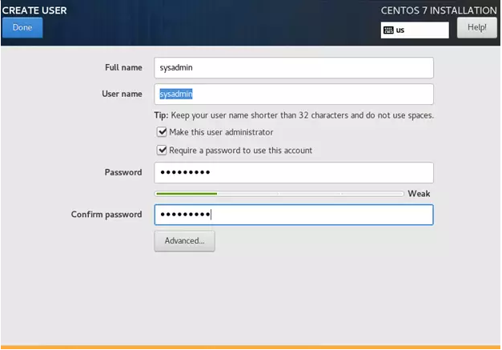

**Các bạn lưu ý ghi nhớ password cho user root và sysadmin này để sử dụng về sau nhé!**

Khi hoàn tất cài đặt sẽ có thông báo để reboot máy ảo, các bạn ấn vào reboot:

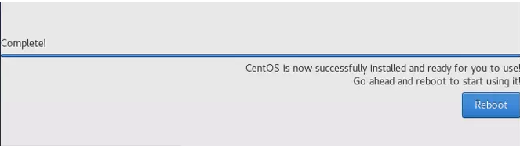

# Cấu hình tham số cho máy ảo

Đầu tiên ta cấu hình cho user sysadmin có quyền sudo không cần password.

Ta đăng nhập với quyền root


```
sudo visudo 
```

```
sysadmin        ALL=(ALL)       NOPASSWD: ALL
```
# Sau đó tắt swap

```
sudo swapoff -a
```

```
sudo vi /etc/fstab
```

# command dùng có swap 

```
#/dev/mapper/centos-swap swap                    swap    defaults        0 0
```

Tới đây trong thư mục kubernetes a-z có 2 file **update-vm.sh** và **update-vm.sh** lấy về và bỏ vào thư mục tùy chọn sau đó cấp quyền cho nó

```
sudo chmod +x update-vm.sh
sudo chmod +x configure-vm.sh
```

kiểm tra quyền:

```
ls -lrt
```

Sau đó chạy lệnh:

```
./configure-vm.sh
```

```
[sysadmin@master1 ~]$ ./configure-vm.sh
Removed symlink /etc/systemd/system/multi-user.target.wants/firewalld.service.
Removed symlink /etc/systemd/system/dbus-org.fedoraproject.FirewallD1.service.
net.ipv4.ip_forward = 1
```

Tắt máy ảo từ session ssh hiện tại:

```
sudo poweroff
```

# Clone máy ảo

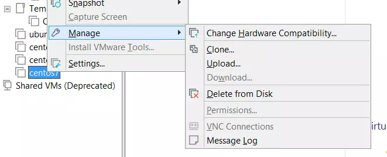

Đầu tiên ta thực hiện clone thành máy ảo master1 ta thực hiện đặt tên và chọn thư mục lưu máy ảo:

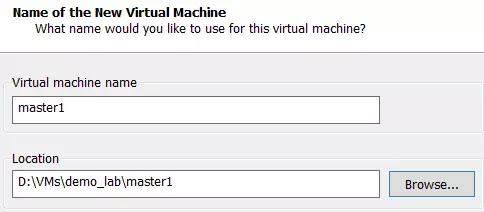

Sau khi hoàn thành ta chọn máy ảo mới clone xong (master1) ==> Chuột phải ==> Setting và điều chỉnh thông số RAM/CPU/HDD như planning ban đầu.

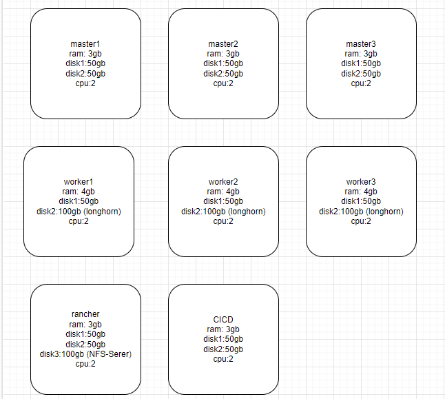

Lặp lại bước clone máy ảo thành các máy master2, master3, worker1, worker2, worker3, rancher và cicd (lưu ý điều chỉnh thông số RAM/CPU/HDD như planning ban đầu).
Tất cả máy ảo master add thêm 1 bộ disk dung lượng 50GB và worker là 100GB
Riêng với máy ảo rancer ta sẽ add thêm cho nó một disk mới dung lượng 100GB (sau này làm NFS server để cài storage class sẽ dùng ở các bài sau): Chuột phải vào máy ảo master1 ==> Setting ==> Add... ==> Hard Disk ==> SCSI ==> Create a new virtual disk ==> Đặt dung lượng 50GB + tick split virtual disk into multiple files ==> Next ==> Finish ==> OK

# Cập nhật lại hostname, IP cho các VM mới clone

Sau khi clone xong 4 máy ảo, thì ta sẽ bật từng máy ảo lên để cấu hình lại cho đúng hostname/IP theo planning (vì full clone nên cả 4 máy ảo này đang được set cùng hostnam/IP).

Ví dụ với master1 ta bật lên, và cập nhật hostname/IP bằng lệnh bên dưới:

Nên thực hiện trên console của VMware Workstation vì sau khi chạy IP của VM sẽ thay đổi về đúng theo planning. Do đó nếu SSH từ một SSH Client thì nó sẽ bị mất kết nối sau khi chạy script

```
[sysadmin@master1 ~]$ ./update-vm.sh master1 192.168.10.11
master1
[sysadmin@master1 ~]$ sudo systemctl restart network
[sysadmin@master1 ~]$ ifconfig ens33 |grep inet
        inet 192.168.10.11  netmask 255.255.255.0  broadcast 192.168.10.255
        inet6 fe80::9dcd:369b:47bd:f107  prefixlen 64  scopeid 0x20<link>
```

Ta mount disk cho tất cả máy ảo
Như vậy disk mới đang ở /dev/sdb. Ta thực hiện mount như sau:

```
sudo mkfs.ext4 /dev/sdb
sudo mkdir /data
sudo mount /dev/sdb /data
```

**Riêng máy ảo rancher ta cần mount thêm để tạo volume NFS-server**

```
sudo mkfs.ext4 /dev/sdb
sudo mkdir /data
sudo mount /dev/sdb /data
```
```
sudo mkfs.ext4 /dev/sdc
sudo mkdir /data2
sudo mount /dev/sdc /data2
```
Như vậy disk mới đã được mount vào /data. Ta cần cấu hình thêm trong /etc/fstab để sau khi khởi động lại nó sẽ tự được mount lại. Ta thêm dòng sau vào file: (Thực hiện cho tất cả máy ảo)

```
sudo vi /etc/fstab
```
Thêm vào dòng này

```
/dev/sdb                    /data  ext4  defaults        0 0
```
Riêng máy ảo rancher cần thêm 2 dòng này

```
/dev/sdb                    /data  ext4  defaults        0 0
/dev/sdc                    /data2  ext4  defaults        0 0
```
