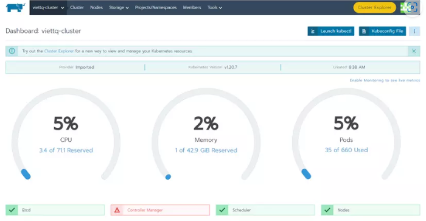
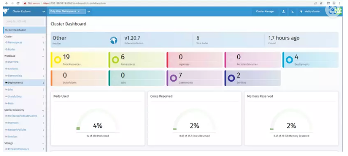

# Cài đặt Rancher để quản lý cụm K8S

--- giờ chuyển sang node rancher --

# Cài đặt docker 
 
 ```
sudo yum update
curl -fsSL https://get.docker.com/ | sh
```

# Cài đặt rancher 

```
docker run --name rancher-server -d --restart=unless-stopped -p 6860:80 -p 6868:443 --privileged rancher/rancher:v2.5.7 
```

--- lưu ý giữa Rancher và Kubernetes có bảng tương thích. Ví dụ bạn cài Kubernetes v1.20.7 thì cần cài Rancher v2.5.7. Các bạn có thể check trên trang chủ của rancher nhé! ---
 
--- sau đó truy cập đến ranher bằng https://<IP node ranher>:6868 ---

Tiếp theo chọn vào Add Cluster --> Other Cluster --> Nhập Cluster Name --> Chọn Create


--- Tiếp theo copy dòng lệnh dưới cùng để chạy trên K8S Master Node để cài đặt rancher-agent lên K8S ---

```
curl --insecure -sfL https://192.168.10.19:6868/v3/import/d6mqd55wnz7vh8ltfg4xvgnfhhmdvmdzxs5m6b24znl5chwjgd977q_c-p4rh9.yaml |kubectl apply -f -
```

---Chờ cho việc cài đặt Agent hoàn thành bạn check kết quả trên giao diện của Rancher--



---Vào tiếp giao diện Cluster Explorer ---



--- Lưu ý nếu như ranher báo Controller Manager unhealthy thì thêm 3 dòng này ở node master ---

```
sudo sed -i 's|- --port=0|#- --port=0|' /etc/kubernetes/manifests/kube-scheduler.yaml
sudo sed -i 's|- --port=0|#- --port=0|' /etc/kubernetes/manifests/kube-controller-manager.yaml
sudo systemctl restart kubelet
```

