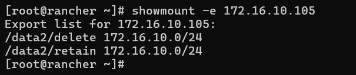
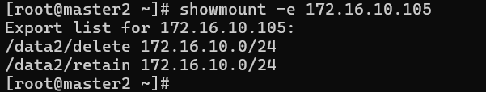
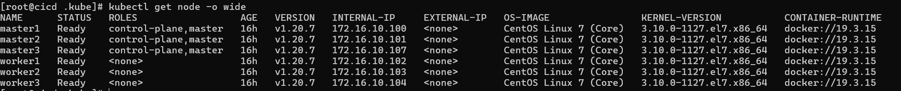
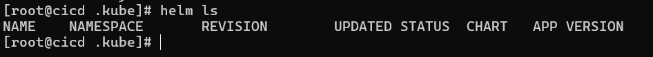
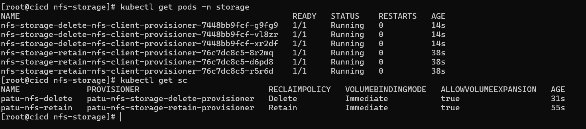
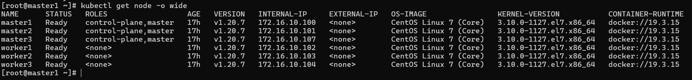
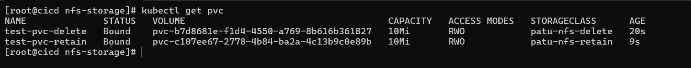
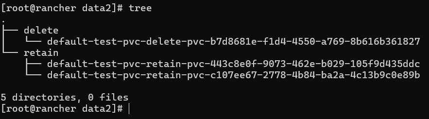
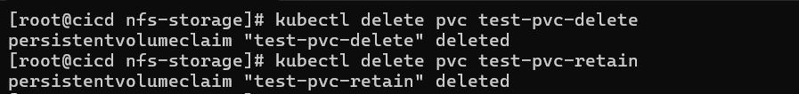
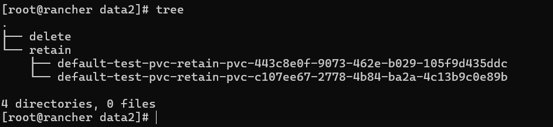

# Cài NFS server trên vps Rancher

--- truy cập vào vps rancher với quyền root---

# Cài đặt NFS-Server

```
#NFS Server installation
sudo -s
yum install nfs-utils -y

#Create shared folder
mkdir -p /data2/delete
mkdir -p /data2/retain

#Change folder
chmod -R 755 /data2
chown -R nfsnobody:nfsnobody /data2
 
systemctl enable rpcbind
systemctl enable nfs-server
systemctl enable nfs-lock
systemctl enable nfs-idmap

systemctl start rpcbind
systemctl start nfs-server
systemctl start nfs-lock
systemctl start nfs-idmap 
#stat service
systemctl restart nfs-server
```
# Cấu hình file export để share quyền cho các node theo format sau mục đích là để cho phép các node trong dải ip 172.16.10.0/24 có quyền vào 2 thư mục /data2/delete và /data2/retain:

```
sudo vi /etc/exports
```

```
/data2/retain    172.16.10.0/24(rw,sync,no_root_squash,no_all_squash)
/data2/delete    172.16.10.0/24(rw,sync,no_root_squash,no_all_squash)
```

# Restart lại NFS server để update cấu hình mới:


```
systemctl restart nfs-server
```

# Kiểm tra 2 thư mục đã được share hay chưa



--- như này là ok rồi ---

# Cài đặt NFS Client trên K8S Node

--- Cần phải cài đặt NFS Client trên tất cả các worker node để khi tạo Pod trên node đó có sử dụng NFS Storage Class thì node đó có thể mount được phân vùng NFS đã được share bởi NFS Server. ---

Cài NFS Client như sau:


```
sudo yum install nfs-utils -y
```

# Sau đó cũng check lại từ node này đã thấy được các folder được share chưa:


```
showmount -e 172.16.10.105
```



--- như này là ok rồi nhé ---


# Cài đặt NFS Storage Class trên K8S
Chỗ này có một chú ý là ban đầu mình đã đứng từ node cicd để cài đặt Kubernetes Cluster bằng Kubespray. Toàn bộ phần cài đặt khác cho cụm K8S mình sẽ thực hiện từ node này để quản lý phần cấu hình cài đặt dễ dàng hơn (quản lý tập trung). Mình sẽ cài đặt NFS Storage Class qua helm chart, do đó cần phải cài helm lên node này trước.

# Cài đặt kubectl và helm

Đăng nhập node cicd bằng quyền root

Do phiên bản Kubernetes đang cài là v1.20.7 nên mình cũng sẽ cài kubectl cùng phiên bản:


```
curl -LO https://dl.k8s.io/release/v1.20.7/bin/linux/amd64/kubectl
sudo install -o root -g root -m 0755 kubectl /usr/local/bin/kubectl
kubectl version --client
```

# Cấu hình kubectl để kết nối tới cụm K8S của mình:


```
mkdir -p $HOME/.kube
scp master1:~/.kube/config  $HOME/.kube/
sudo chown $(id -u):$(id -g) $HOME/.kube/config
```

sau đó sửa file cấu hình lại tham số "server: https://127.0.0.1:6443" thành "server: https://172.16.10.100:6443" 

```
sudo vi ~/.kube/config
```



Như này là cấu hình thành công rồi đó !!!

Giờ tiêp tục cài helm thôi.

Tạo thư mục mới để chứa helm 

```
mkdir /home/k8s_tools
```

```
curl -fsSL -o get_helm.sh https://raw.githubusercontent.com/helm/helm/main/scripts/get-helm-3
sudo chmod 700 get_helm.sh
./get_helm.sh
```



Như này là cài đặt helm thành công


# Cài đặt NFS Storage

Tạo thư mục cài đặt để lưu helm-chart và các file config sau này:

```
cd /home/sysadmin/kubernetes_installation
mkdir nfs-storage
cd nfs-storage
```

Download helm chart nfs-client-provisioner về để cài offline:

```
helm repo add stable https://charts.helm.sh/stable
helm search repo nfs-client-provisioner
helm pull stable/nfs-client-provisioner --version 1.2.11
tar -xzf nfs-client-provisioner-1.2.11.tgz
```

Trước khi cài đặt cần thay đổi tham số mặc định của helm chart này.

```
cp nfs-client-provisioner/values.yaml values-nfs-delete.yaml
cp nfs-client-provisioner/values.yaml values-nfs-retain.yaml
```

Thay đổi các tham số trong file values-nfs-delete.yaml như sau:

```
replicaCount: 3
server: 172.16.10.105
path: /data2/delete
provisionerName: patu-nfs-storage-delete-provisioner
name: patu-nfs-delete
reclaimPolicy: Delete
archiveOnDelete: false
```

Thay đổi các tham số trong file values-nfs-retain.yaml như sau:

```
replicaCount: 3
server: 172.16.10.105
path: /data2/retain
provisionerName: patu-nfs-storage-retain-provisioner
name: patu-nfs-retain
reclaimPolicy: Retain
archiveOnDelete: true
```

Giờ thì cài đặt 2 storage class này thôi, nhưng nhớ tạo một namespace riêng cho phần storage để dễ bề quản lý nhé:

```
kubectl create namespace "storage"
helm install nfs-storage-retain --namespace storage -f values-nfs-retain.yaml nfs-client-provisioner
helm install nfs-storage-delete --namespace storage -f values-nfs-delete.yaml nfs-client-provisioner
```

Kết quả cài đặt sẽ như thế này:



# Kiểm tra nfs-storageclass bằng cách tạo thử pvc

Giờ tạo một PVC xem thằng nfs-storageclass nó có tự động sinh ra PV cho mình không nhé! Tạo file config cho PVC có reclaim policy là delete như sau, lưu ý tham số storageClassName: patu-nfs-delete được gán đúng với tên storage class mình đã tạo ở bước trước:

```
kind: PersistentVolumeClaim
apiVersion: v1
metadata:
  name: test-pvc-delete
spec:
  storageClassName: patu-nfs-delete
  accessModes:
    - ReadWriteOnce
  resources:
    requests:
      storage: 10Mi
```
Tạo thêm một file config cho PVC có relaim policy là retain:

```
kind: PersistentVolumeClaim
apiVersion: v1
metadata:
  name: test-pvc-retain
spec:
  storageClassName: patu-nfs-retain
  accessModes:
    - ReadWriteOnce
  resources:
    requests:
      storage: 10Mi
```

Tạo PVC bằng lệnh kubectl:

```
[root@cicd nfs-storage]$ kubectl apply -f test-pod-pvc-delete.yaml
pod/test-pod created
[root@cicd nfs-storage]$ kubectl get pvc
NAME              STATUS    VOLUME   CAPACITY   ACCESS MODES   STORAGECLASS        AGE
test-pvc-delete   Pending                                      patu-nfs-delete   6s
```

Rồi tới đây bắt đầu có vấn đề, mọi thứ đã làm đúng hết thì thằng PVC này phải được gán PV cho nó chứ, tức là phải ở trạng thái "Bound" chứ sao lại pending mãi vậy??

Đây là một known-issue của Kubernetes phiên bản v1.20.7 này, cách xử lý thực hiện update lại file /etc/kubernetes/manifests/kube-apiserver.yaml trên tất cả các Master Node, thêm một config như sau - --feature-gates=RemoveSelfLink=false, nhìn nó sẽ kiểu ntn:

```
    - --tls-cert-file=/etc/kubernetes/ssl/apiserver.crt
    - --tls-private-key-file=/etc/kubernetes/ssl/apiserver.key
    #fix nfs-storageclass issue
    - --feature-gates=RemoveSelfLink=false
    image: k8s.gcr.io/kube-apiserver:v1.20.7
    imagePullPolicy: IfNotPresent
```

```
vi /etc/kubernetes/manifests/kube-apiserver.yaml
```

sau đó ngồi đợi khoảng 2-3p thì nó tự động reset kube-api:



Như này là ok rồi!

Ta chạy lệnh này để khởi tạo pvc:

```
kubectl apply -f test-pvc-retain.yaml
kubectl apply -f test-pvc-delete.yaml
```

Rồi bây giờ kiểm tra pvc được gán vào pv chưa nhé:



Status Bound là được gán thành công rồi .

sau đó chúng ta kiểm tra để hiểu về DELETE và RETAIN



Như vậy ta thấy các phân vùng được tạo ở đúng các thư mục như cấu hình storage class. Giờ xóa cả 2 PVC xem chuyện gì xảy ra:




Quay trở lại NFS-Server để kiểm tra:


