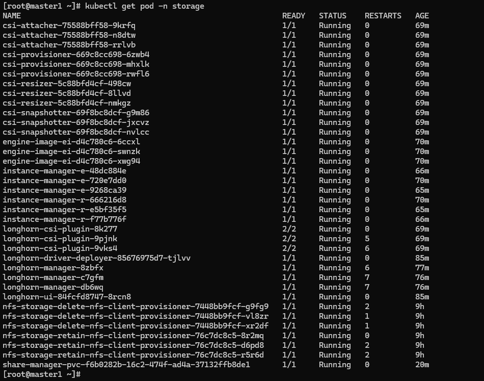
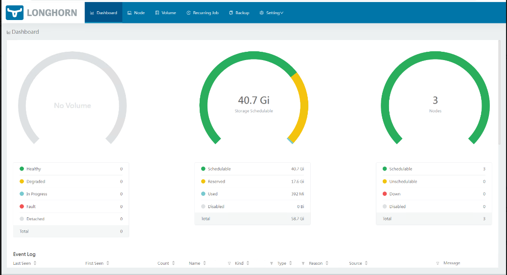
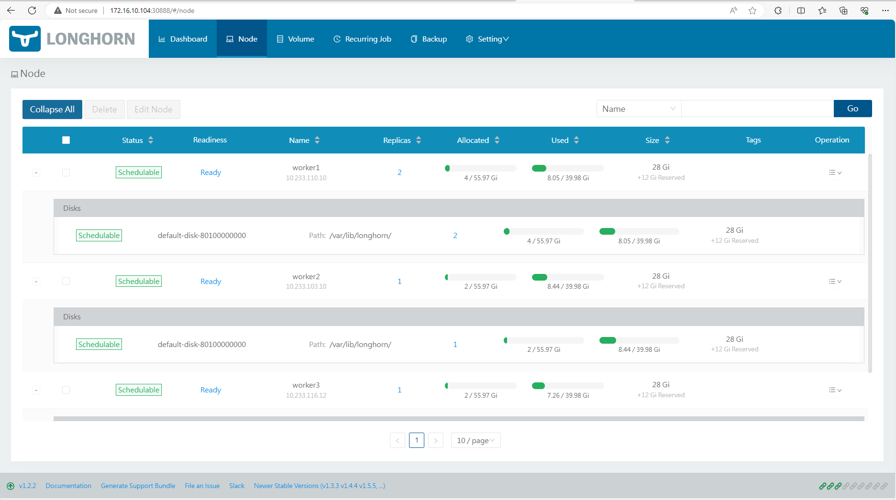
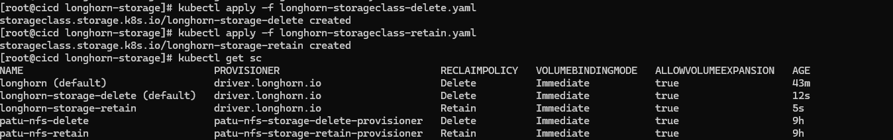
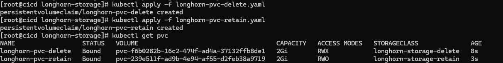
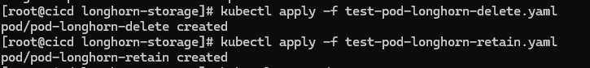
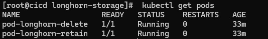
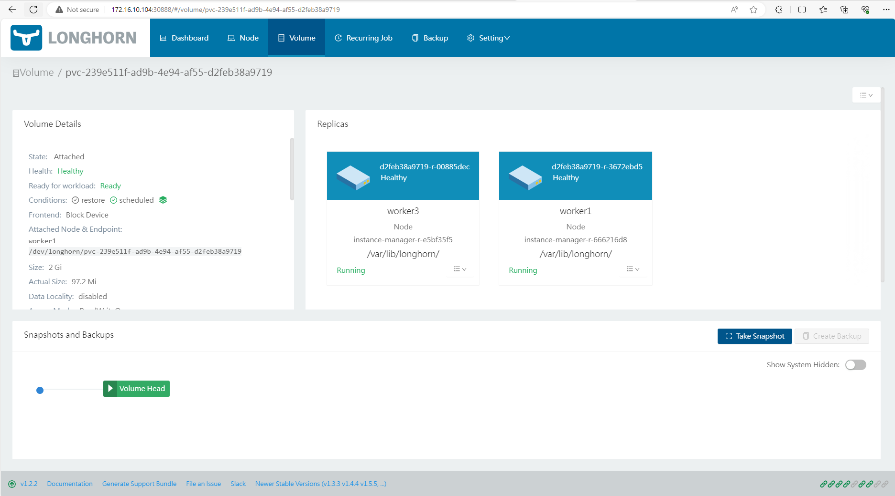

# Cài đặt Storage cho K8S dùng longhorn

# Ta sẽ có 2 phần: 

+ Longhorn storage: Là storage quản lý thiết bị lưu trữ, nó có vai trò giống như NFS Server vậy

+ Longhorn storage class: Là một object trên K8S đảm nhiệm việc nhận các yêu cầu tạo Volume trên K8S (PV/PVC) sau đó kết nối với longhorn storage để tạo ra phân vùng lưu trữ trên thiết bị lưu trữ

# Các bước thực hiện

Chuẩn bị phân vùng lưu dữ liệu trên các Worker Node

Cài đặt longhorn storage trên K8S dùng helm chart

Cài đặt longhorn storage class trên K8S

Test thử tạo PV/PVC và tạo Pod dùng longhorn storage class

**Vẫn có một lưu ý nữa mình xin nhắc lại là việc cài đặt đều được thực hiện trên node vtq-cicd để quản lý tập trung các file cấu hình cài đặt được dễ dàng.**

# Cài đặt longhorn storage

Ta sẽ cài đặt thư mục mặc định lưu dữ liệu của longhorn là /data/longhorn-storage, do đó cần tạo thư mục nào trên các Worker Node:

```
sudo mkdir -p /data/longhorn-storage
```
# Cài đặt longhorn storage

Do ở phần trước mình đã cài và cấu hình kubectl và helm trên node cicd rồi nên ở đây mình không cần thực hiện lại nữa. Giờ bắt tay vào cài longhorn thôi.

Đầu tiên là tạo thư mục lưu helm chart và các file cấu hình đã:

```
cd /home/sysadmin/kubernetes_installation
mkdir longhorn-storage
cd longhorn-storage
```

Khai báo repo và download helm chart của longhorn về:


```
helm repo add longhorn https://charts.longhorn.io
helm repo update
```

Sau bước trên mình đã down về và giải nén thư mục helm chart của longhorn ở thư mục /home/sysadmin/kubernetes_installation/longhorn-storage

Tạo mới 1 file values có đường dẫn /home/sysadmin/kubernetes_installation/longhorn-storage

```
vi values-longhorn.yaml
```

Copy nguyên nội dung file values-longhorn.yaml past vào file vừa tạo

**Thêm một lưu ý là phải cài thêm open-iscsi cho các Worker Node để nó có thể mount được phân vùng từ longhorn storage** 

```
yum -y install iscsi-initiator-utils
```

Khởi tạo longhorn bằng helm ta chạy lệnh sau 

```
helm install longhorn-storage -f values-longhorn.yaml longhorn/longhorn --version 1.2.2 --namespace storage
```



Như thế này là đã khởi tạo thành công

**sau đó ta truy cập thông qua IP:30888 của node master và kiểm tra thành quả**



Thông tin các node



# Cài đặt longhorn storage class trên K8S

Tới đây lại phải nhớ trong đầu là ta sẽ phải tạo 2 loại storage class ứng với 2 loại reclaim policy là delete và retain. Ta tạo 2 file config như sau:

**longhorn-storageclass-delete.yaml**

```
kind: StorageClass
apiVersion: storage.k8s.io/v1
metadata:
  name: longhorn-storage-delete
  annotations:
    storageclass.kubernetes.io/is-default-class: "true"
provisioner: driver.longhorn.io
allowVolumeExpansion: true
reclaimPolicy: Delete
volumeBindingMode: Immediate
parameters:
  numberOfReplicas: "2"
  staleReplicaTimeout: "2880"
  fromBackup: ""
  fsType: "ext4"
```

**longhorn-storageclass-retain.yaml**

```
kind: StorageClass
apiVersion: storage.k8s.io/v1
metadata:
  name: longhorn-storage-retain
provisioner: driver.longhorn.io
allowVolumeExpansion: true
reclaimPolicy: Retain
volumeBindingMode: Immediate
parameters:
  numberOfReplicas: "2"
  staleReplicaTimeout: "2880"
  fromBackup: ""
  fsType: "ext4"
```

**Cài đặt 2 storage class này thôi:**



**Tới đây là đã hoàn thành cài đặt longhorn và storage class trên K8S sẵn sàng cho workload rồi ^^!**

# Test thử tạo PV/PVC và tạo Pod dùng longhorn storage class

Mình sẽ tạo 2 PVC và 2 pod sử dụng 2 PVC này, mỗi PVC dùng một storage class của longhorn:

**longhorn-pvc-delete.yaml**

```
apiVersion: v1
kind: PersistentVolumeClaim
metadata:
  name: longhorn-pvc-delete
spec:
  accessModes:
    #- ReadWriteOnce
    - ReadWriteMany
  storageClassName: longhorn-storage-delete
  resources:
    requests:
      storage: 2Gi
```

**longhorn-pvc-retain.yaml**

```
apiVersion: v1
kind: PersistentVolumeClaim
metadata:
  name: longhorn-pvc-retain
spec:
  accessModes:
    - ReadWriteOnce
  storageClassName: longhorn-storage-retain
  resources:
    requests:
      storage: 2Gi
```

**test-pod-longhorn-delete.yaml**

```
kind: Pod
apiVersion: v1
metadata:
  name: pod-longhorn-delete
spec:
  volumes:
        - name: longhorn-pvc-delete
          persistentVolumeClaim:
            claimName: longhorn-pvc-delete
  containers:
    - name: my-container
      volumeMounts:
        - name: longhorn-pvc-delete # This is the name of the volume we set at the pod level
          mountPath: /var/simple # Where to mount this directory in our container

      # Now that we have a directory mounted at /var/simple, let's
      # write to a file inside it!
      image: alpine
      command: ["/bin/sh"]
      args: ["-c", "while true; do date >> /var/simple/file.txt; sleep 5; done"]
```

**test-pod-longhorn-retain.yaml**

```
kind: Pod
apiVersion: v1
metadata:
  name: pod-longhorn-retain
spec:
  volumes:
        - name: longhorn-pvc-retain
          persistentVolumeClaim:
            claimName: longhorn-pvc-retain
  containers:
    - name: my-container
      volumeMounts:
        - name: longhorn-pvc-retain # This is the name of the volume we set at the pod level
          mountPath: /var/simple # Where to mount this directory in our container

      # Now that we have a directory mounted at /var/simple, let's
      # write to a file inside it!
      image: alpine
      command: ["/bin/sh"]
      args: ["-c", "while true; do date >> /var/simple/file.txt; sleep 5; done"]
```

Tạo xong các file yaml thì tạo trước 2 PVC và xem kết quả:



Như vậy 2 PVC đều đã được longhorn storage class cấp PV cho rồi (STATUS là Bound). Giờ mình tạo tiếp 2 Pod dùng 2 PVC bên trên:




Kiểm tra trên giao diện của Longhorn để thấy phân vùng được tạo và được replicas theo cấu hình đã tạo (2 replicas):




**Tới đây mình đã hoàn thành cài đặt longhorn storage trên Kubernetes Cluster và tạo các longhorn storage class**