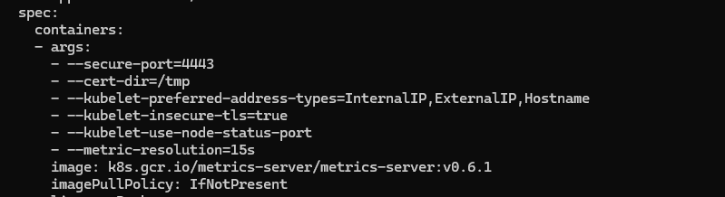
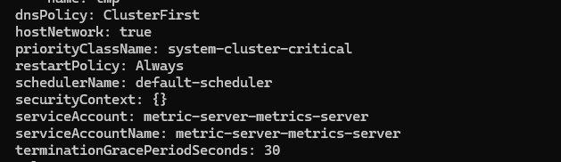
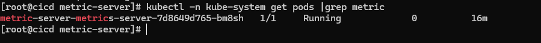
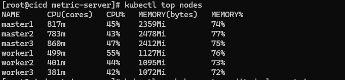

# Metrics Server cho K8S và demo HPA

**Cài đặt Metrics Server**

Phần này thì cơ bản là đơn giản, khi cài đặt lần đầu có thể bạn sẽ gặp phải một số vấn nho nhỏ phát sinh mà nếu chưa có kinh nghiệm debug trên K8S thì có thể sẽ bị stuck luôn thì hơi chán. Bản thân mình lần đầu cài cũng phải troubleshoot toát mồ hôi, nên giờ sẽ note cho các bạn tiết kiệm thời gian nhất, chạy phát là ăn ngay.

**Cài đặt Metrics Server bằng helm-chart**

Vẫn như mọi khi, mình sẽ đứng từ node cicd để bắt đầu cài đặt. Trước hết là tạo thư mục lưu file cài đặt:

```
cd /home/sysadmin/kubernetes_installation/
mkdir metric-server
cd metric-server
```

Thực hiện cài đặt Metrics Server:

```
helm repo add metrics-server https://kubernetes-sigs.github.io/metrics-server/
helm pull metrics-server/metrics-server --version 3.8.2
tar -xzf metrics-server-3.8.2.tgz
helm install metric-server metrics-server -n kube-system
```

Tới đây cần edit lại deployment của Metrics Server để fix lỗi liên quan tới kết nối. Bạn chạy lệnh sau:

```
kubectl -n kube-system edit deploy metric-server-metrics-server
```

Sau đó sửa các tham số dưới thẻ "args" cho giống như bên dưới:




```
spec:
      containers:
      - args:
        - --secure-port=4443
        - --cert-dir=/tmp
        - --kubelet-preferred-address-types=InternalIP,ExternalIP,Hostname
        - --kubelet-insecure-tls=true
        - --kubelet-use-node-status-port
        - --metric-resolution=15s
        image: k8s.gcr.io/metrics-server/metrics-server:v0.6.1
        imagePullPolicy: IfNotPresent
        livenessProbe:
          failureThreshold: 3
```

```
dnsPolicy: ClusterFirst
hostNetwork: true
priorityClassName: system-cluster-critical
restartPolicy: Always
schedulerName: default-scheduler
securityContext: {}
serviceAccount: metric-server-metrics-server
serviceAccountName: metric-server-metrics-server
terminationGracePeriodSeconds: 30
```
Lưu lại và chờ Pod được update lại. Các bạn có thể tham khảo thêm về issue này ở topic trên Github và StackOverFlow:

https://github.com/kubernetes-sigs/metrics-server/issues/278

https://stackoverflow.com/questions/68648198/metrics-service-in-kubernetes-not-working

```
kubectl -n kube-system get pods |grep metric
```



Như trên là Metrics Server chạy được rồi, giờ kiểm tra tải của node xem sao:

```
kubectl top nodes
```




# Cấu hình Autoscaling với HPA

**Đầu tiên là cứ tạo thư mục để làm cái lab này đã:**

```
cd /home/sysadmin/kubernetes_installation/
mkdir hpa-example
cd hpa-example
```

Ý tưởng của bài lab HPA này là bạn tạo ra một Deployment gồm 1 Pod chạy Apache và một service trỏ tới Pod đó. Sau đó bạn cấu hình HPA cho Deployment đó với điều kiện tải CPU của pod > 50% thì sẽ scale số pod lên, và khi tải giảm xuống thì số pod cũng dc giảm theo.

Bắt đầu thôi, bạn tạo file cho Deployment như sau:

**php-apache.yaml**

```
apiVersion: apps/v1
kind: Deployment
metadata:
  name: php-apache
spec:
  selector:
    matchLabels:
      run: php-apache
  replicas: 1
  template:
    metadata:
      labels:
        run: php-apache
    spec:
      containers:
      - name: php-apache
        image: k8s.gcr.io/hpa-example
        ports:
        - containerPort: 80
        resources:
          limits:
            cpu: 500m
          requests:
            cpu: 200m
---
apiVersion: v1
kind: Service
metadata:
  name: php-apache
  labels:
    run: php-apache
spec:
  ports:
  - port: 80
  selector:
    run: php-apache
```

**Sau đó thì apply file trên để tạo Deployment và Service:**

```
kubectl apply -f php-apache.yaml
```

```
[root@cicd hpa-example]$ kubectl get all
NAME                             READY   STATUS    RESTARTS   AGE
pod/php-apache-d4cf67d68-gzxb6   1/1     Running   0          2m56s

NAME                 TYPE        CLUSTER-IP      EXTERNAL-IP   PORT(S)          AGE
service/my-service   NodePort    10.233.13.185   <none>        8080:31132/TCP   20h
service/php-apache   ClusterIP   10.233.12.122   <none>        80/TCP           2m56s

NAME                         READY   UP-TO-DATE   AVAILABLE   AGE
deployment.apps/php-apache   1/1     1            1           2m56s

NAME                                   DESIRED   CURRENT   READY   AGE
replicaset.apps/php-apache-d4cf67d68   1         1         1       2m56s
```

Như vậy là các bạn có thể thấy đang có 1 Pod của php-apache đang chạy. Giờ ta sẽ cấu hình HPA cho cái Deployment này, để khi các Pod của nó tăng tải thì sẽ được autoscale:

```
kubectl autoscale deployment php-apache --cpu-percent=50 --min=1 --max=10
kubectl get hpa
```

```
NAME         REFERENCE               TARGETS         MINPODS   MAXPODS   REPLICAS   AGE
php-apache   Deployment/php-apache   <unknown>/50%   1         10        0          2s
```

**Chuẩn bị đến chỗ hay rồi, giờ ta sẽ tăng tải cho thằng php-apache bằng cách chạy một Pod gọi liên tục tới php-apache. Bạn nên mở 2 cửa sổ terminal nhé, một cái để chạy pod để generate load, một cái để theo dõi trạng thái của Deployment để xem nó autoscale như thế nào.**

```
kubectl run -i --tty load-generator --rm --image=busybox:1.28 --restart=Never -- /bin/sh -c "while sleep 0.01; do wget -q -O- http://php-apache; done"
```

Xong rồi ngồi theo dõi thôi, bạn dùng lệnh sau để xem phim nhé 😄

```
kubectl get hpa php-apache --watch
```

Nào xem phim có gì hay:

```
NAME         REFERENCE               TARGETS   MINPODS   MAXPODS   REPLICAS   AGE
php-apache   Deployment/php-apache   21%/50%   1         10        1          4m24s
```

```
NAME         REFERENCE               TARGETS   MINPODS   MAXPODS   REPLICAS   AGE
php-apache   Deployment/php-apache   21%/50%   1         10        1          4m24s
php-apache   Deployment/php-apache   250%/50%   1         10        1          4m36s
php-apache   Deployment/php-apache   250%/50%   1         10        4          4m52s
```

Tải vẫn đang tăng dần và hệ thống đã autoscale số pod lên 4 rồi. Do maxpods ta cấu hình là 10 nên chờ thêm khi đạt ngưỡng thì sao nhé:

```
NAME         REFERENCE               TARGETS   MINPODS   MAXPODS   REPLICAS   AGE
php-apache   Deployment/php-apache   21%/50%   1         10        1          4m24s
php-apache   Deployment/php-apache   250%/50%   1         10        1          4m36s
php-apache   Deployment/php-apache   250%/50%   1         10        4          4m52s
php-apache   Deployment/php-apache   250%/50%   1         10        5          5m7s
php-apache   Deployment/php-apache   69%/50%    1         10        5          5m53s
php-apache   Deployment/php-apache   67%/50%    1         10        5          6m8s
php-apache   Deployment/php-apache   59%/50%    1         10        7          6m39s
php-apache   Deployment/php-apache   47%/50%    1         10        7          8m11s
```

Có thể để ý thấy tải tăng càng lúc càng chậm, đơn giản vì lúc đầu bạn chỉ có 1 pod, giờ có 7 pod thì tải sẽ chậm gấp 7 lần so với lúc đầu 😄 nên chờ thêm chút nhé!

```
[root@vcicd hpa-example]$ kubectl get hpa php-apache --watch
NAME         REFERENCE               TARGETS   MINPODS   MAXPODS   REPLICAS   AGE
php-apache   Deployment/php-apache   21%/50%   1         10        1          4m24s
php-apache   Deployment/php-apache   250%/50%   1         10        1          4m36s
php-apache   Deployment/php-apache   250%/50%   1         10        4          4m52s
php-apache   Deployment/php-apache   250%/50%   1         10        5          5m7s
php-apache   Deployment/php-apache   69%/50%    1         10        5          5m53s
php-apache   Deployment/php-apache   67%/50%    1         10        5          6m8s
php-apache   Deployment/php-apache   46%/50%    1         10        7          9m27s
php-apache   Deployment/php-apache   48%/50%    1         10        7          11m
php-apache   Deployment/php-apache   93%/50%    1         10        10         11m
```

Rồi lên đỉnh điểm rồi thì phải xuống thôi, giờ ta tắt cái Pod generate load đi để tải nó tụt xuống rồi xem hệ thống autoscale down số pod xuống như thế nào nhé:

```
[root@cicd hpa-example]$ kubectl get hpa php-apache --watch
NAME         REFERENCE               TARGETS   MINPODS   MAXPODS   REPLICAS   AGE
php-apache   Deployment/php-apache   0%/50%    1         10        10         16m
php-apache   Deployment/php-apache   0%/50%    1         10        10         18m
php-apache   Deployment/php-apache   0%/50%    1         10        9          18m
php-apache   Deployment/php-apache   0%/50%    1         10        1          18m
```

Đó khi không còn cao tải nữa (CPU < 50%) thì hệ thống autoscale down số pod của Deployment xuống về đúng trạng thái ban đầu (1 pod).

Trên đây là một ví dụ đơn giản để các bạn hiểu về ý tưởng hoạt động của Autoscale. Ngoài đặt ngưỡng RAM/CPU bạn có thể customize theo rất nhiều điều kiện khác tùy vào nhu cầu thực tế. Các bạn có thể tham khảo thêm về HPA trên trang của Kubernetes: https://kubernetes.io/docs/tasks/run-application/horizontal-pod-autoscale/

**Như vậy sau bài viết này bạn đã biết cách cài Metrics Server và cũng voọc qua cách sử dụng của HPA rồi.**
