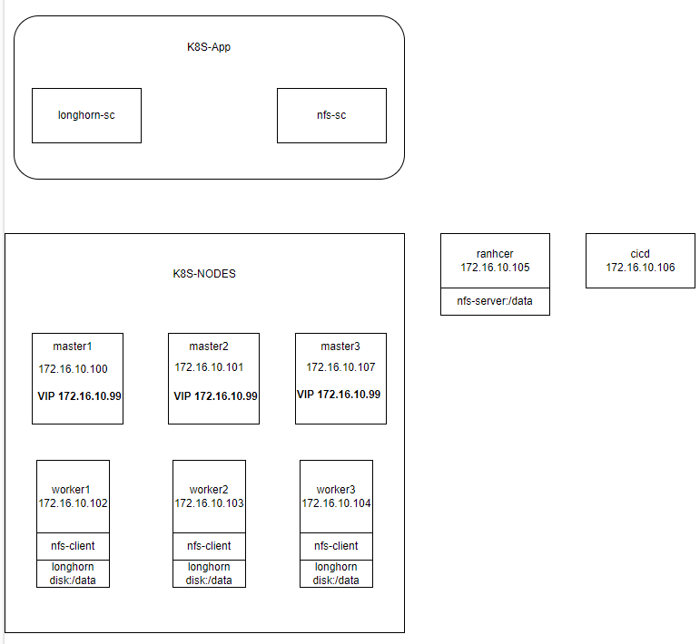
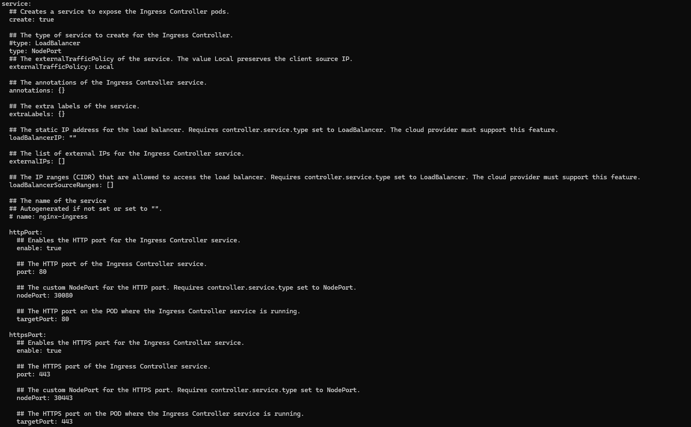
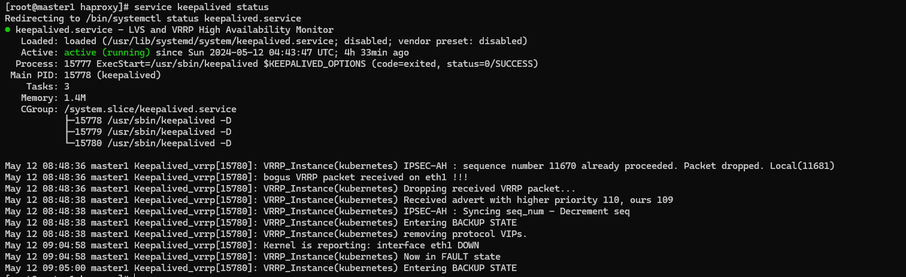
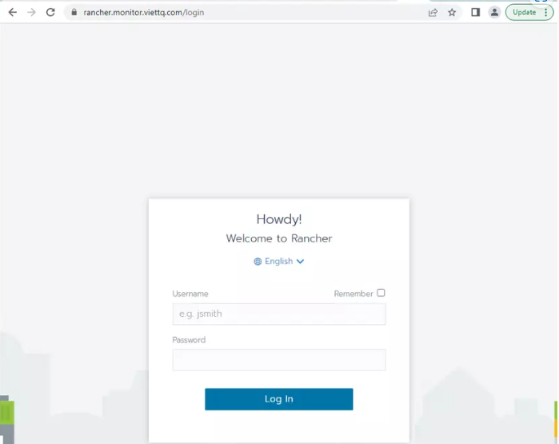

# Phần 6 - Load Balancing trên Kubernetes dùng Haproxy và Nginx-Ingress

Hôm nay mình sẽ tiếp tục chia sẻ về việc cài đặt Load Balancing trên K8S. Thông thường các service trên K8S muốn expose được ra bên ngoài có 2 cách là dùng Node Port hoặc dùng Nginx-Ingress. Mỗi cách đều có ưu nhược điểm và đều tùy vào trường hợp mà được sử dụng khác nhau.

Thường thì mình thấy ingress phù hợp với các service dạng http/https, còn Node Port đương nhiên cũng dùng được cho http/https nhưng thường thì lại sử dụng cho các trường hợp còn lại. Ví dụ bạn muốn expose Kafka, VerneMQ ra ngoài thì bạn sẽ nghĩ tới node port chứ ko nhất thiết phải qua Nginx-Ingress vì cấu hình Node Port đơn giản và mất ít thao tác hơn.

Một điểm nữa cần lưu ý là service trên K8S khi được expose ra sẽ có entry-point là các IP của các node. Do đó để đảm bảo được Load Balancing thì thông người sẽ cần một service làm nhiệm vụ LB cho các node đó, thường gặp sẽ là Haproxy hoặc Nginx (sẽ được cài trên các K8S node đó). Như vậy Haproxy giải quyết được bài toán Load Balancing. Còn vấn đề dự phòng HA (High Availability) thì chưa.


Để tiếp tục giải quyết bài toán HA cho dịch vụ, thì ta sẽ nghĩ đến giải pháp dùng VIP để tăng khả năng HA, khi một node down thì sẽ vẫn còn node khác xử lý được để không ảnh hưởng dịch vụ. VIP thì mình thấy phổ biến nhất là Keepalived, hoặc có thể tham khảo PCS.

**Trong phạm vi bài viết này mình sẽ chia sẻ cách cài đặt cấu hình Haproxy/Keepalived và Nginx-Ingress để thực hiện Load Balancing cho các dịch vụ trên trong K8S**

# Về kiến trúc

Lab Kubernetes Cluster của mình gồm 03 master node và 03 worker node. Một node cài rancher (rancher), một node cài Jenkins (cicd) và cũng là nơi chứa toàn bộ các cấu hình phần mềm cài đặt cho K8S.



# Nguyên lý hoạt động

**Nginx-Ingress**

Nginx-Ingress được cài trên K8S, nó được gọi là Ingress-Controller, và service của nó thì sẽ được expose ra ngoài K8S bằng Node Port. Nó đóng vai trò là cầu nối từ thế giới bên ngoài vào các service bên trong K8S vậy.

**Haproxy**

Đóng vai trò là Load Balancer của hệ thống, do đó nó là nơi tiếp nhận mọi request tới các dịch vụ. Ta sẽ phải cấu hình cho haproxy để nó hiểu là với các request nào thì forward tới đâu.

**Keepalived**

Hiểu đơn giản là ví dụ bạn có 3 máy chủ cùng có chạy một dịch vụ, bạn muốn khi một máy chủ bị down thì client vẫn sử dụng được dịch vụ bình thường, khi đó Keepalive sẽ giải quyết vấn đề của bạn.

Như trong mô hình lab này, nếu mình chỉ cài Haproxy trên node master1 (master1) để làm LB. Khi đó client sẽ cần kết nối tới IP của node master1 này để sử dụng dịch vụ. Nếu node này down thì dịch vụ cũng tạch. Để giải quyết, mình sẽ cài Keepalive trên cả 3 node và cấu hình ra một VIP (Virtual IP), tại một thời điểm sẽ chỉ có 1 trong 3 node nhận VIP đó. Client sẽ chỉ quan tâm tới VIP để sử dụng dịch vụ, không quan tâm tới 3 IP của 3 node là gì. Khi một node down thì KeepAlived sẽ tự động kiểm tra và chuyển VIP sang một node khác còn active. Như vậy thì Haproxy sẽ cần được cài và cấu hình trên tất cả các node cài keepalive.

# Cài đặt

**Cài đặt Haproxy và KeepAlived**

Cài đặt trên 3 master node (lưu ý mình đang dùng centos):

```
sudo yum install haproxy -y
sudo yum install keepalived -y
```

Cài đặt thêm rsyslog để cấu hình log của haproxy

Cài đặt rsyslog trên centos:

```
sudo yum install -y rsyslog
```

Tạo mới file config /etc/rsyslog.d/haproxy.conf để sau này check log của haproxy cho tiện debug:

```
cd /etc/rsyslog.d
sudo vi haproxy.conf
```

```
# Collect log with UDP
$ModLoad imudp
$UDPServerAddress 127.0.0.1
$UDPServerRun 514

# Creating separate log files based on the severity
local0.* /var/log/haproxy-traffic.log
local0.notice /var/log/haproxy-admin.log
```
Sau đó restart lại rsyslog để apply:

```
sudo service rsyslog restart
```

# Cài đặt Nginx-Ingress

Thực hiện trên máy chủ cicd (cicd) để lưu cấu hình cài đặt. Ta tạo thư mục lưu cài đặt như mọi khi:

```
/home/sysadmin/kubernetes_installation
mkdir nginx-ingress
cd nginx-ingress
```

Download bộ cài về và tạo file config:

```
helm repo add  nginx-stable https://helm.nginx.com/stable
helm repo update
helm search repo nginx
helm pull nginx-stable/nginx-ingress --version 0.13.0
tar -xzf nginx-ingress-0.13.0.tgz
cp nginx-ingress/values.yaml value-nginx-ingress.yaml
```

Mình sẽ sửa lại vài tham số của file value mặc định như sau để cho nó chạy Node Port ra 2 port là 30080 và 30443:

```
type: NodePort
## The custom NodePort for the HTTP port. Requires controller.service.type set to NodePort.
nodePort: 30080
## The custom NodePort for the HTTPS port. Requires controller.service.type set to NodePort.
nodePort: 30443
```

đổi lại như này:



Tạo namespace riêng và cài đặt lên:

```
kubectl create ns nginx-ingress
helm -n nginx-ingress install nginx-ingress -f value-nginx-ingress.yaml nginx-ingress
```

Kiểm tra kết quả:

```
[sysadmin@cicd nginx-ingress]$  kubectl -n nginx-ingress get pods
NAME                                          READY   STATUS    RESTARTS   AGE
nginx-ingress-nginx-ingress-f5b87cc54-hs2lp   1/1     Running   0          7m39s

```

Tranh thủ ở đây deploy một service để lát nữa test với Load Balancer luôn nhé! Tạo file **apple.yaml** có nội dung như sau để tạo một pod và service web (gọi là Apple app nhé)

```
kind: Pod
apiVersion: v1
metadata:
  name: apple-app
  labels:
    app: apple
spec:
  containers:
    - name: apple-app
      image: hashicorp/http-echo
      args:
        - "-text=THIS_IS_APPLE"

---

kind: Service
apiVersion: v1
metadata:
  name: apple-service
spec:
  selector:
    app: apple
  ports:
    - port: 5678 # Default port for image

```

Sau đó deploy lên k8s:

```
kubectl -n nginx-ingress apply -f apple.yaml
```

Giờ ta tạo tiếp 1 ingress để kết nối vào Apple app vừa cài bên trên từ domain là apple.prod.viettq.com/apple nhé! Tạo file cấu hình ingress **app.ingress.yaml** :

```
apiVersion: networking.k8s.io/v1
kind: Ingress
metadata:
  annotations:    
  name: apple.prod.viettq.com  
spec:
  ingressClassName: nginx
  rules:
  - host: apple.prod.viettq.com
    http:
      paths:
      - backend:
          service:
            name: apple-service
            port:
              number: 5678
        path: /
        pathType: Prefix
```

Sau đó tạo ingress này trên k8s bằng cách apply file yaml trên:

```
kubectl -n nginx-ingress apply -f app.ingress.yaml
```

Như vậy lý thuyết khi client gọi tới domain là http://apple.prod.viettq.com/ thì nó sẽ kết nối tới Apple app qua service apple-service

# Cấu hình Load Balancing

**Cấu hình VIP cho Keepalived**

Ý tưởng là cấu hình trên cả 2 node master có chung 1 VIP, mỗi node sẽ có một độ ưu tiên khác nhau. Và Keepalived sẽ định kỳ check nếu service Haproxy trên node đó mà down thì trọng số của node cũng sẽ giảm theo --> Node khác sẽ lên làm master của cụm và sẽ được gán VIP vào.

Trong lab này mình có 3 node master:

```
Node	  IP	          VIP	          State	  priority
master1	172.16.10.100	172.16.10.99	Master	100
master2	172.16.10.101	172.16.10.99	Backup	99
master3	172.16.10.107	172.16.10.99	Backup	98
```

Như vậy 03 node trên đều là master node của k8s, nhưng với keepalived thì node master1 đóng vai trò master, 2 node còn lại là backup (với độ ưu tiên thấp hơn).

Sửa file config của master1 ở đường dẫn /etc/keepalived/keepalived.conf như sau:(xóa luôn file gốc rồi tạo lại với cấu hình sau)

```
cd /etc/keepalived/
sudo rm -rf keepalived.conf
vi keepalived.conf
```

```
vrrp_script haproxy-check {
    script "killall -0 haproxy"
    interval 2
    weight 10
}

vrrp_instance kubernetes {
    state MASTER
    priority 100
    interface ens37
    virtual_router_id 61
    advert_int 2
    authentication {
        auth_type AH
        auth_pass viettq
    }
    virtual_ipaddress {
        172.16.10.99
    }

    track_script {
        haproxy-check
    }
}
```

Trong đó interface là NIC mà bạn muốn cấu hình VIP. Ví dụ như trong lab của mình là ens37:

```
[root@master1 haproxy]# ip a |grep 172.16.10.100 -A1 -B2
2: ens37: <BROADCAST,MULTICAST,UP,LOWER_UP> mtu 1500 qdisc pfifo_fast state UP group default qlen 1000
    link/ether 00:0c:29:e2:90:31 brd ff:ff:ff:ff:ff:ff
    inet 172.16.10.100/24 brd 172.16.10.255 scope global noprefixroute ens37
       valid_lft forever preferred_lft forever

```

Restart service keepalived trên node này và kiểm tra có VIP mới được tạo ra. Kiểm tra trạng thái của Keepalived:

```
[root@master1 haproxy]# service keepalived status
Redirecting to /bin/systemctl status keepalived.service
● keepalived.service - LVS and VRRP High Availability Monitor
   Loaded: loaded (/usr/lib/systemd/system/keepalived.service; disabled; vendor preset: disabled)
   Active: active (running) since Fri 2022-04-15 03:45:08 EDT; 2s ago
  Process: 7218 ExecStart=/usr/sbin/keepalived $KEEPALIVED_OPTIONS (code=exited, status=0/SUCCESS)
 Main PID: 7219 (keepalived)
    Tasks: 3
   Memory: 1.7M
   CGroup: /system.slice/keepalived.service
           ├─7219 /usr/sbin/keepalived -D
           ├─7220 /usr/sbin/keepalived -D
           └─7221 /usr/sbin/keepalived -D

May 12 09:05:00 master1 Keepalived_vrrp[7221]: Registering gratuitous ARP shared channel
May 12 09:05:00 master1 Keepalived_vrrp[7221]: Opening file '/etc/keepalived/keepalived.conf'.
May 12 09:05:00 master1 Keepalived_vrrp[7221]: WARNING - default user 'keepalived_script' for script execution does not exist - please create.
May 12 09:05:00 master1 Keepalived_vrrp[7221]: Cannot find script killall in path
May 12 09:05:00 master1 Keepalived_vrrp[7221]: Disabling track script haproxy-check since not found
May 12 09:05:00 master1 Keepalived_vrrp[7221]: VRRP_Instance(kubernetes) removing protocol VIPs.
May 12 09:05:00 master1 Keepalived_vrrp[7221]: Using LinkWatch kernel netlink reflector...
May 12 09:05:00 master1 Keepalived_vrrp[7221]: VRRP sockpool: [ifindex(2), proto(51), unicast(0), fd(10,11)]
May 12 09:05:00 master1 Keepalived_vrrp[7221]: VRRP_Instance(kubernetes) Transition to MASTER STATE
May 12 09:05:00 master1 Keepalived_vrrp[7221]: VRRP_Instance(kubernetes) Changing effective priority from 100 to 110
```

Như kết quả trên thì script check đang lỗi "Cannot find script killall in path". Do đó để chạy được thì cần cài gói psmisc và restart lại keepalived:

```
sudo yum install psmisc -y 
sudo service keepalived restart
```

Kết quả sẽ như sau:


Lúc này check lại IP của node sẽ thấy VIP 172.16.10.99 mới được tạo ra:

```
[root@master1 ~]# ip a |grep 172 -A3 -B2
3: eth1: <BROADCAST,MULTICAST,UP,LOWER_UP> mtu 1500 qdisc pfifo_fast state UP group default qlen 1000
    link/ether 08:00:27:05:e6:c4 brd ff:ff:ff:ff:ff:ff
    inet 172.16.10.100/24 brd 172.16.10.255 scope global noprefixroute eth1
       valid_lft forever preferred_lft forever
    inet 172.16.10.99/32 scope global eth1
       valid_lft forever preferred_lft forever
4: docker0: <NO-CARRIER,BROADCAST,MULTICAST,UP> mtu 1500 qdisc noqueue state DOWN group default
    link/ether 02:42:7b:6a:82:97 brd ff:ff:ff:ff:ff:ff
    inet 172.17.0.1/16 brd 172.17.255.255 scope global docker0
       valid_lft forever preferred_lft forever
5: kube-ipvs0: <BROADCAST,NOARP> mtu 1500 qdisc noop state DOWN group default
    link/ether ca:b9:7b:41:db:76 brd ff:ff:ff:ff:ff:ff
```

Thực hiện cấu hình keepalive cho 2 node còn lại với các bước như trên, với các cấu hình như sau:

**master2: /etc/keepalived/keepalived.conf**

```
vrrp_script haproxy-check {
    script "killall -0 haproxy"
    interval 2
    weight 10
}

vrrp_instance kubernetes {
    state BACKUP
    priority 99
    interface ens37
    virtual_router_id 61
    advert_int 2
    authentication {
        auth_type AH
        auth_pass viettq
    }
    virtual_ipaddress {
        172.16.10.99
    }

    track_script {
        haproxy-check
    }
}
```

**master3: /etc/keepalived/keepalived.conf**


```
vrrp_script haproxy-check {
    script "killall -0 haproxy"
    interval 2
    weight 10
}

vrrp_instance kubernetes {
    state BACKUP
    priority 98
    interface ens37
    virtual_router_id 61
    advert_int 2
    authentication {
        auth_type AH
        auth_pass viettq
    }
    virtual_ipaddress {
        172.16.10.99
    }

    track_script {
        haproxy-check
    }
}
```

***Sau bước này ta đã cấu hình 3 k8s-master node có chung VIP 172.16.10.99, khi service haproxy trên node keepalived-master down (hoặc cả node keepalived-master down) thì VIP sẽ được chuyển sang node keepalived-backup (dựa vào tham số priority trong cấu hình keepalived). Bạn lưu ý không bị nhầm giữa master/worker node của K8S và master/backup của Keepalived nhé!***

# Cấu hình haproxy

Để cấu hình LB cho các service trong K8S thì đơn giản là bạn tạo rule để round-robin các request tới các master-node tại Node Port của Nginx-Ingress là xong. Phần còn lại sẽ con Nginx-Ingress phân tích URL của request và forward tiếp tới các server dựa vào các ingress-rule đã khai báo trên K8S.

Ta cần thực hiện cấu hình haproxy cho cả 3 master node giống hệt nhau. Vì bạn nên hiểu, chỉ node nào đang nhận VIP sẽ làm nhiệm vụ LB, còn các node còn lại ở trạng thái backup sẵn sàng chia bài thay khi node master down.

Cấu hình service haproxy ở file config /etc/haproxy/haproxy.cfg. Ở đây mình có 2 backend, một default là trỏ mọi request tới Nginx-Ingress của K8S, một là check hostname nếu là rancher.monitor.viettq.com thì forward tới rancher server đang cài trên node rancher.

**Và ta cũng sẽ tạo SSL certificate cho các ứng dụng của mình. Các bạn xem hướng dẫn tạo SSL Certificate chi tiết ở session7**

Kết quả sinh ra lưu vào file /etc/haproxy/ssl/server.pem để dùng cho cấu hình haproxy.

```
cd /etc/haproxy/
rm -rf haproxy.cfg
vi haproxy.cfg 
```

```
global
    log         127.0.0.1:514 local0

    chroot      /var/lib/haproxy
    pidfile     /var/run/haproxy.pid
    maxconn     4000
    user        haproxy
    group       haproxy
    daemon
    stats socket /var/lib/haproxy/stats
    stats socket *:1999 level admin
    stats socket /var/run/haproxy.sock mode 600 level admin
    
defaults
    mode                    http
    log                     global
    option                  httplog
    option                  dontlognull
    option http-server-close
    option forwardfor       except 127.0.0.0/8
    option                  redispatch
    retries                 3
    timeout http-request    10s
    timeout queue           1m
    timeout connect         10s
    timeout client          1m
    timeout server          1m
    timeout http-keep-alive 10s
    timeout check           10s
    maxconn                 3000

listen stats
    bind *:8085
    stats enable
    stats uri /stats
    stats realm HAProxy-04\ Statistics
    stats auth admin:password
    stats admin if TRUE

backend per_ip_and_url_rates
    stick-table type binary len 8 size 1m expire 24h store http_req_rate(24h)

backend per_ip_rates
    stick-table type ip size 1m expire 24h store gpc0,gpc0_rate(30s)

frontend frontend_ssl_443
        bind :80
        #bind *:443 ssl crt /etc/haproxy/ssl/viettq.com.pem
        bind *:443 ssl crt /etc/haproxy/ssl/server.pem
        mode http
        option httpclose
        option forwardfor
        reqadd X-Forwarded-Proto:\ https
        #http-request set-header X-Forwarded-Proto:\ https
        cookie  SRVNAME insert indirect nocache
        default_backend backend_ingress
        #default_backend backend_rancher

        acl rancher hdr_dom(host) -i rancher.monitor.viettq.com
        use_backend backend_rancher if rancher

backend backend_ingress
        mode    http
        stats   enable
        stats   auth username:password
        balance roundrobin
        server  worker1 172.16.10.102:30080 cookie p1 weight 1 check inter 2000
        server  worker2 172.16.10.103:30080 cookie p1 weight 1 check inter 2000
        server  worker3 172.16.10.104:30080 cookie p1 weight 1 check inter 2000


backend backend_rancher
        mode    http
        stats   enable
        stats   auth username:password
        balance roundrobin
        server  rancher 172.16.10.105:6860 cookie p1 weight 1 check inter 2000
```

**Sau đó check cú pháp xem có lỗi gì không trước khi restart service:**

```
[sysadmin@master1 haproxy]# haproxy -c -f haproxy.cfg
Configuration file is valid
[sysadmin@master1 haproxy]# sudo service haproxy restart
Redirecting to /bin/systemctl restart haproxy.service
```

**NOTE: Nếu start haproxy mà gặp lỗi kiểu như bên dưới**

```
systemd[1]: Started HAProxy Load Balancer.
haproxy-systemd-wrapper[2358]: haproxy-systemd-wrapper: executing /usr/sbin/haproxy -f /etc/haproxy/haproxy.cf...id -Ds
haproxy-systemd-wrapper[2358]: [ALERT] 012/095413 (2359) : Starting proxy stats: cannot bind socket [0.0.0.0:8888]
haproxy-systemd-wrapper[2358]: haproxy-systemd-wrapper: exit, haproxy RC=256
```

**Thì các bạn thử chạy thêm một lệnh sau:**

```
setsebool -P haproxy_connect_any=1
```

Sau đó restart lại haproxy service.

```
sudo service haproxy restart
```

# Cấu hình ở client và kiểm tra kết nối

Để kết nối được vào hệ thống, thì như đã giới thiệu ở đầu bài viết, client sẽ chỉ quan tâm tới VIP chứ ko cần biết 3 IP của 3 k8s master node. Bài toán đặt là client muốn kết nối tới 2 dịch vụ là rancher (rancher.monitor.viettq.com/) và Apple app (apple.prod.viettq.com/) thì phải làm như thế nào?

Client sẽ cần khai file host trên máy client với nội dung như sau:

ta cần tìm đến file hosts trên windown sau đó copy ra ngoài desktop(có thể thư mục nào củng được miễn được cấp full quyền) sau đó chúng ta thêm vào 2 dòng sau

```
172.16.10.99 rancher.monitor.viettq.com
172.16.10.99 apple.prod.viettq.com
```
Như vậy khi client kết nối tới địa chỉ http://rancher.monitor.viettq.com/ thì kết quả sẽ như sau:



Tiếp tục kết nối tới Apple app ở địa chỉ http://apple.prod.viettq.com/ và kết quả:


# Kiểm tra tính sẵn sàng (High Availability)

Hiện tại node master1 đang là master của cụm VIP và đang nhận VIP, cũng là node đang thực hiện load balancing cho hệ thống.

```
[sysadmin@master1 haproxy]$ ip a |grep 172
    inet 172.16.10.100/24 brd 172.16.10.255 scope global noprefixroute ens37
    inet 172.16.10.99/32 scope global ens37
```

Ta sẽ test thử stop haproxy trên node này xem chuyện gì sẽ xảy ra:

```
sudo service haproxy stop
```
```
[root@master1 ssl]# sudo service haproxy stop
Redirecting to /bin/systemctl stop haproxy.service
[root@master1 ssl]# clear;sudo service keepalived status
Redirecting to /bin/systemctl status keepalived.service
● keepalived.service - LVS and VRRP High Availability Monitor
   Loaded: loaded (/usr/lib/systemd/system/keepalived.service; disabled; vendor preset: disabled)
   Active: active (running) since Sun 2024-05-12 02:21:11 UTC; 8h ago
  Process: 19610 ExecStart=/usr/sbin/keepalived $KEEPALIVED_OPTIONS (code=exited, status=0/SUCCESS)
 Main PID: 19616 (keepalived)
    Tasks: 3
   Memory: 2.4M
   CGroup: /system.slice/keepalived.service
           ├─19616 /usr/sbin/keepalived -D
           ├─19617 /usr/sbin/keepalived -D
           └─19619 /usr/sbin/keepalived -D

May 12 08:48:28 master1 Keepalived_vrrp[19619]: Sending gratuitous ARP on ens37 for 172.16.10.99
May 12 10:31:28 master1 Keepalived_vrrp[19619]: /usr/bin/killall -0 haproxy exited with status 1
May 12 10:31:28 master1 Keepalived_vrrp[19619]: VRRP_Script(haproxy-check) failed
May 12 10:31:30 master1 Keepalived_vrrp[19619]: VRRP_Instance(kubernetes) Changing effective priority from 110 to 100
May 12 10:31:30 master1 Keepalived_vrrp[19619]: /usr/bin/killall -0 haproxy exited with status 1
May 12 10:31:32 master1 Keepalived_vrrp[19619]: VRRP_Instance(kubernetes) Received advert with higher priority 108, ours 100
May 12 10:31:32 master1 Keepalived_vrrp[19619]: VRRP_Instance(kubernetes) IPSEC-AH : Syncing seq_num - Decrement seq
May 12 10:31:32 master1 Keepalived_vrrp[19619]: VRRP_Instance(kubernetes) Entering BACKUP STATE
May 12 10:31:32 master1 Keepalived_vrrp[19619]: VRRP_Instance(kubernetes) removing protocol VIPs.
May 12 10:31:32 master1 Keepalived_vrrp[19619]: /usr/bin/killall -0 haproxy exited with status 1
```

Bạn để ý thông tin output gồm "VRRP_Script(haproxy-check) failed" và "VRRP_Instance(kubernetes) Changing effective priority from 110 to 100". Giải thích lại chỗ này: 3 node sẽ có priority ban đầu lần lượt là 100, 99 và 98. Kèm theo đó là trên cấu hình của keepalived mỗi lần check thấy service haproxy còn sống thì trọng số cộng thêm 10. Tức là trường hợp 3 node đều chạy ok thì trọng số sẽ là 110, 109 và 108.

Khi haproxy trên node1 bị down, thì trọng số của nó chỉ còn là 100, và lúc nào node 2 có trọng số là 109 sẽ dc đẩy lên làm master và sẽ nhận VIP.

Xem trên node 2 sẽ rõ nó sẽ được gán VIP:

```
[root@master2 haproxy]# sudo service keepalived status
Redirecting to /bin/systemctl status keepalived.service
● keepalived.service - LVS and VRRP High Availability Monitor
   Loaded: loaded (/usr/lib/systemd/system/keepalived.service; disabled; vendor preset: disabled)
   Active: active (running) since Sun 2024-05-12 04:43:47 UTC; 5h 52min ago
  Process: 15777 ExecStart=/usr/sbin/keepalived $KEEPALIVED_OPTIONS (code=exited, status=0/SUCCESS)
 Main PID: 15778 (keepalived)
    Tasks: 3
   Memory: 1.4M
   CGroup: /system.slice/keepalived.service
           ├─15778 /usr/sbin/keepalived -D
           ├─15779 /usr/sbin/keepalived -D
           └─15780 /usr/sbin/keepalived -D

May 12 10:36:32 master2 Keepalived_vrrp[15780]: Sending gratuitous ARP on eth1 for 172.16.10.99
May 12 10:36:32 master2 Keepalived_vrrp[15780]: Sending gratuitous ARP on eth1 for 172.16.10.99
May 12 10:36:32 master2 Keepalived_vrrp[15780]: Sending gratuitous ARP on eth1 for 172.16.10.99
May 12 10:36:32 master2 Keepalived_vrrp[15780]: Sending gratuitous ARP on eth1 for 172.16.10.99
May 12 10:36:35 master2 Keepalived_vrrp[15780]: Sending gratuitous ARP on eth1 for 172.16.10.99
May 12 10:36:35 master2 Keepalived_vrrp[15780]: VRRP_Instance(kubernetes) Sending/queueing gratuitous ARPs on eth1 for 172.16.10.99
May 12 10:36:35 master2 Keepalived_vrrp[15780]: Sending gratuitous ARP on eth1 for 172.16.10.99
May 12 10:36:35 master2 Keepalived_vrrp[15780]: Sending gratuitous ARP on eth1 for 172.16.10.99
May 12 10:36:35 master2 Keepalived_vrrp[15780]: Sending gratuitous ARP on eth1 for 172.16.10.99
May 12 10:36:35 master2 Keepalived_vrrp[15780]: Sending gratuitous ARP on eth1 for 172.16.10.99
```

Check IP của node 2:

```
[root@master2 haproxy]# ip a |grep 172 -A1 -B2
3: eth1: <BROADCAST,MULTICAST,UP,LOWER_UP> mtu 1500 qdisc pfifo_fast state UP group default qlen 1000
    link/ether 08:00:27:4c:07:d0 brd ff:ff:ff:ff:ff:ff
    inet 172.16.10.101/24 brd 172.16.10.255 scope global noprefixroute eth1
       valid_lft forever preferred_lft forever
    inet 172.16.10.99/32 scope global eth1
       valid_lft forever preferred_lft forever
4: docker0: <NO-CARRIER,BROADCAST,MULTICAST,UP> mtu 1500 qdisc noqueue state DOWN group default
    link/ether 02:42:b0:a5:9f:50 brd ff:ff:ff:ff:ff:ff
    inet 172.17.0.1/16 brd 172.17.255.255 scope global docker0
       valid_lft forever preferred_lft forever
```

Lúc này client kết nối vẫn theo VIP và vẫn sử dụng dịch vụ bình thường:


