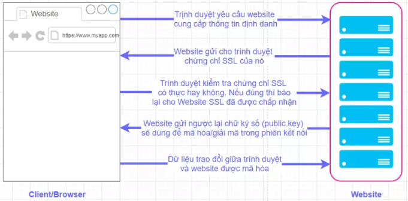
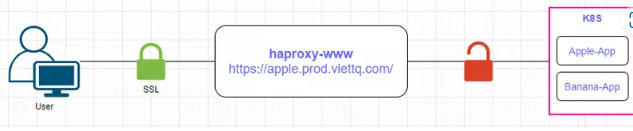
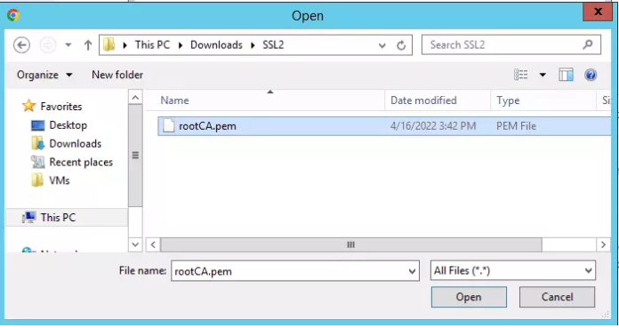
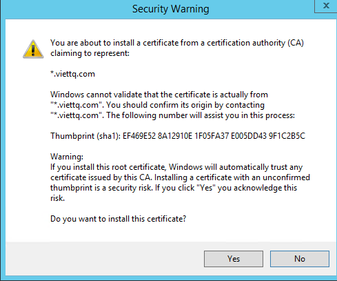

# Phần 7 - Hướng dẫn tạo tích xanh cho ứng dụng trên K8S dùng OpenSSL

**Lời tựa**

Chào các bạn, hôm nay mình sẽ chia sẻ cách để tạo "tích xanh" cho ứng dụng chạy trên K8S ở local 😄. Thì nhiều bạn sẽ thắc mắc "tích xanh" là gì? Câu trả lời đó là app của bạn có sử dụng Chứng thư số SSL (SSL Certification)

SSL là viết tắt của từ Secure Sockets Layer. SSL là tiêu chuẩn của công nghệ bảo mật, truyền thông mã hoá giữa máy chủ Web server và trình duyệt nhằm đảm bảo tính riêng tư và toàn vẹn dữ liệu khi truyền giữa các máy chủ Web và các trình duyệt ở client. SSL hiện tại cũng là tiêu chuẩn bảo mật cho hàng triệu website trên toàn thế giới, nó bảo vệ dữ liệu truyền đi trên môi trường internet được an toàn.

Chứng thư số SSL cài trên website của doanh nghiệp cho phép khách hàng khi truy cập có thể xác minh được tính xác thực, tin cậy của website, đảm bảo mọi dữ liệu, thông tin trao đổi giữa website và khách hàng được mã hóa, tránh nguy cơ bị can thiệp.

**Một số khái niệm về SSL**

**Certificate Authority (CA)**

CA là tổ chức phát hành các chứng thực các loại chứng thư số (Certificate) cho người dùng, doanh nghiệp, máy chủ (server), mã code, phần mềm. Nhà cung cấp chứng thực số đóng vai trò là bên thứ ba (được cả hai bên tin tưởng) để hỗ trợ cho quá trình trao đổi thông tin an toàn. Ví dụ một số nhà cung cấp chứng thư phổ biến như Global Sign, VeriSign, DigiCert..

**Domain Validation (DV SSL)**

Chứng thư số SSL chứng thực cho Domain Name – Website. Khi 1 Website sử dụng DV SSL thì sẽ được xác thực tên domain, website đã được mã hoá an toàn khi trao đổi dữ liệu.

**Organization Validation (OV SSL)**

Chứng thư số SSL chứng thực cho Website và xác thực doanh nghiệp đang sở hữu website đó .

**Extended Validation (EV SSL)**

Cho khách hàng của bạn thấy Website đang sử dụng chứng thư SSL có độ bảo mật cao nhất và được rà soát pháp lý kỹ càng.

**Subject Alternative Names (SANs SSL)**

Nhiều tên miền hợp nhất trong 1 chứng thư số:

Một chứng thư số SSL tiêu chuẩn chỉ bảo mật cho duy nhất một tên miền đã được kiểm định. Lựa chọn thêm SANs chỉ với chứng thư duy nhất bảo đảm cho nhiều tên miền con. SANs mang lại sự linh hoạt cho người sử dụng, dễ dàng hơn trong việc cài đặt, sử dụng và quản lý chứng thư số SSL.

Chứng thư số SSL SANs có thể tích hợp với tất cả các loại chứng thư số SSL của GlobalSign bao gồm: Chứng thực tên miền (DV SSL), Chứng thực tổ chức doanh nghiệp (OV SSL) và Chứng thực mở rộng cao cấp (EV SSL).

**Wildcard SSL Certificate (Wildcard SSL)**

Sản phẩm lý tưởng dành cho các cổng thương mại điện tử. Mỗi e-store là một sub-domain và được chia sẻ trên một hoặc nhiều địa chỉ IP. Khi đó, để triển khai giải pháp bảo bảo mật giao dịch trực tuyến (đặt hàng, thanh toán, đăng ký & đăng nhập tài khoản,…) bằng SSL, chúng ta có thể dùng duy nhất một chứng chỉ số Wildcard cho tên miền chính của website và tất cả sub-domain.

**Kiểm tra tính xác thực của SSL**

Khi Website gởi cho trình duyệt một chứng chỉ SSL, Trình duyệt sẽ gởi chứng chỉ này đến một máy chủ lưu trữ các chứng chỉ số đã được phê duyệt. Các máy chủ này được thành lập bởi những công ty uy tín như GlobalSign, VeriSign.

Về mặt kỹ thuật, SSL sử dụng mã hóa công khai. Kỹ thuật này giúp cho Website và Trình duyệt tự thỏa thuận một bộ khóa sẽ dùng trong suốt quá trình trao đổi thông tin sau đó.

Bộ khóa sẽ thay đổi theo mỗi trong lần giao dịch kế tiếp, một người khác sẽ không thể giải mã ngay cả khi có được dữ liệu của máy chủ lưu trữ chứng chỉ số nói trên.

**Cơ chế hoạt động khi sử dụng SSL**



**Lợi ích khi sử dụng SSL**

Xác thực website, giao dịch.

Nâng cao hình ảnh, thương hiệu và uy tín doanh nghiệp.

Bảo mật các giao dịch giữa khách hàng và doanh nghiệp, các dịch vụ truy nhập hệ thống.

Bảo mật webmail và các ứng dụng như Outlook Web Access, Exchange, và Office Communication Server.

Bảo mật các ứng dụng ảo hó như Citrix Delivery Platform hoặc các ứng dụng điện toán đám mây.

Bảo mật dịch vụ FTP.

Bảo mật truy cập control panel.

Bảo mật các dịch vụ truyền dữ liệu trong mạng nội bộ, file sharing, extranet.

Bảo mật VPN Access Servers, Citrix Access Gateway …

Website không được xác thực và bảo mật sẽ luôn ẩn chứa nguy cơ bị xâm nhập dữ liệu, dẫn đến hậu quả khách hàng không tin tưởng sử dụng dịch vụ.

**Một lợi ích lớn khác nữa khi bạn cấu hình SSL cho các app ở local của bạn thì nhìn nó sẽ PRO hơn, đẹp mắt hơn!!**

# SSL Termination

Trong mô hình Load Balancing, HAProxy đứng giữa client và các backend servers, vì vậy kết nối mã hóa SSL giữa client và server sẽ có thể được thực hiện theo các cách thức sau:

Thực hiện yêu cầu kết nối mã hóa SSL giữa Client và HAProxy, còn từ HAProxy thực hiện các kết nối không mã hóa với backend servers. Phương thức này gọi là SSL Termination --> Giúp giảm mức độ mức phức tạp khi chỉ phải quản lý SSL Certificate ở node Haproxy, và giảm tải CPU cho các webserver khi việc mã hóa/giải mã được thực hiện ở Haproxy



Thực hiện yêu cầu kết nối trực tiếp giữa Client và các backend servers. Tuy nhiên, khi đó chúng ta lại không thể thực hiện Add/Set phần Header. Phương thức này gọi là SSL Passthrough

**Hướng dẫn tự tạo self-signed certificate để chạy trên local (tạo tích xanh 😄)**

**Tạo Certificate Authority**

Thông thường để có Cert "Xịn", hàng Auth thì bạn phải mua của các nhà cung cấp chứng thư (gọi là CA). Nhưng ta có thể tự tạo một CA ở trên Local và nhập vào trình duyệt để trình duyệt hiểu là CA (mà chúng ta tạo ra) là một nhà cung cấp CA tin cậy. Sau đó, các chứng chỉ được cấp bởi CA này sẽ được coi là hợp lệ.

**Tạo private key cho CA:**

```
openssl genrsa -des3 -out rootCA.key 2048
Enter pass phrase for rootCA.key:
Verifying - Enter pass phrase for rootCA.key:
```

Nhập thông tin pass phrase cho rootCA.key, cái này do bạn tự đặt nhé!

**Tạo file pem từ file private key (nhập pass của rootCA đã tạo bên trên)**

```
[root@viettq-master1 ssl2]# openssl req -x509 -new -nodes -key rootCA.key -sha256 -days 1825 -out rootCA.pem
Enter pass phrase for rootCA.key:
You are about to be asked to enter information that will be incorporated
into your certificate request.
What you are about to enter is what is called a Distinguished Name or a DN.
There are quite a few fields but you can leave some blank
For some fields there will be a default value,
If you enter '.', the field will be left blank.
-----
Country Name (2 letter code) [XX]:VN
State or Province Name (full name) []:HN
Locality Name (eg, city) [Default City]:HN
Organization Name (eg, company) [Default Company Ltd]:VietTQ_CA
Organizational Unit Name (eg, section) []:VietTQ_CA_Unit
Common Name (eg, your name or your server's hostname) []:*.viettq.com
Email Address []:viettq@email.com
```

Sau bước này mình sẽ có 2 file .key và .pem cho rootCA:

```
[root@master1 ssl2]# ls -lrt
total 8
-rw-r--r-- 1 root root 1751 Apr 16 04:27 rootCA.key
-rw-r--r-- 1 root root 1424 Apr 16 04:29 rootCA.pem
```

**Nhập thông tin CA vừa tạo cho trình duyệt (client)**

**Đối với trình duyệt chrome**

Sau đó mở Chrome và vào địa chỉ này để vào mục setting: chrome://settings/security --> Chọn vào Manage certificates Trong hộp thoại hiện ra bạn vào tab **Trusted Root Certification Authorities** --> Import --> Next --> Browse --> Chọn file rootCA.pem --> Next --> Next --> Finish.



Khi hộp thoại Security Warning hiện lên bạn chọn vào Yes, sau đó close hộp thoại và lúc nào thông tin CA đã được import vào Chrome.



**Tạo SSL Certificate cho ứng dụng web ở local**

Đầu tiên ta tạo một file openssl.cnf để cấu hình thêm thông tin SAN như sau:

```
[req]
distinguished_name = req_distinguished_name
req_extensions = v3_req
[req_distinguished_name]
countryName = VN
countryName_default = VN
stateOrProvinceName = HN
stateOrProvinceName_default = HN
localityName = HN
localityName_default = HN
organizationalUnitName = VietTQ_DEVOPS
organizationalUnitName_default = VietTQ_DEVOPS
commonName = *.viettq.com
commonName_max = 64
[ v3_req ]
# Extensions to add to a certificate request
basicConstraints = CA:FALSE
keyUsage = nonRepudiation, digitalSignature, keyEncipherment
subjectAltName = @alt_names
[alt_names]
DNS.1 = *.monitor.viettq.com
DNS.2 = *.prod.viettq.com
DNS.3 = *.demo.viettq.com
```

Ở đây mình sẽ tạo SSL Certcificate cho các app của mình sử dụng 3 subdomain là *.monitor.viettq.com, *.prod.viettq.com và *.demo.viettq.com

Tiếp theo ta tạo file key:

```
sudo openssl genrsa -out viettq_app.key 2048
```

Sau đó ta tạo file Sigining Request từ file key và file config trên:

```
sudo openssl req -new -out viettq_app.csr -key viettq_app.key -config openssl.cnf
```

Sau đó ta tạo file Sigining Request từ file key và file config trên:

```
sudo openssl req -new -out viettq_app.csr -key viettq_app.key -config openssl.cnf
```

Kết quả sinh ra file **viettq_app.csr**

```
[root@master1 ssl2]# ls -lrt
total 20
-rw-r--r-- 1 root root 1751 Apr 16 04:27 rootCA.key
-rw-r--r-- 1 root root 1424 Apr 16 04:29 rootCA.pem
-rw-r--r-- 1 root root 1679 Apr 16 04:58 viettq_app.key
-rw-r--r-- 1 root root  641 Apr 16 04:59 openssl.cnf
-rw-r--r-- 1 root root 1131 Apr 16 04:59 viettq_app.csr
```

Rồi tới bước quan trọng nhất là mang đơn đi đóng dấu 😄. File .csr (Certificate Siging Request) giống như tờ đơn xin xác nhận của bạn, phải bạn cần mang đi xin ông CA đóng dấu cho. Và vì mình đã tự đóng vai trò CA (với 2 file .key và .pem đã tạo ở bước trước) thì mình sẽ tự đóng dấu cho yêu cầu này:

```
[root@master1 ssl]# sudo openssl x509 -req -days 3650 -in viettq_app.csr -CA rootCA.pem -CAkey rootCA.key -CAcreateserial -out viettq_app.crt -extensions v3_req -extfile openssl.cnf
Signature ok
subject=/C=VN/ST=HN/L=HN/OU=VietTQ_DEVOPS/CN=*.viettq.com
Getting CA Private Key
Enter pass phrase for rootCA.key:
[root@master1 ssl]# ls -lrt
total 28
-rw-r--r-- 1 root root 1751 Apr 16 04:27 rootCA.key
-rw-r--r-- 1 root root 1424 Apr 16 04:29 rootCA.pem
-rw-r--r-- 1 root root 1679 Apr 16 04:58 viettq_app.key
-rw-r--r-- 1 root root  641 Apr 16 04:59 openssl.cnf
-rw-r--r-- 1 root root 1131 Apr 16 04:59 viettq_app.csr
-rw-r--r-- 1 root root   17 Apr 16 05:02 rootCA.srl
-rw-r--r-- 1 root root 1371 Apr 16 05:02 viettq_app.crt
```

Kết quả sẽ sinh ra file viettq_app.crt. Bây giờ ta sẽ tạo file viettq_app.pem từ 3 file viettq_app.key, viettq_app.csr và viettq_app.crt:

```
cat viettq_app.key > server.pem
cat viettq_app.csr >> server.pem
cat viettq_app.crt >> server.pem
```